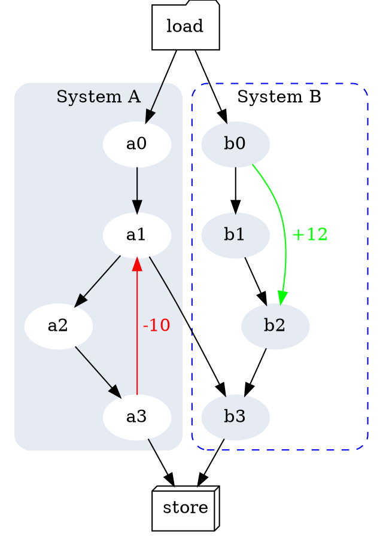

# Using Pandoc And Its GraphViz Filter

From [this post](http://nrstickley.com/pandoc/example.html), I read the following command line to call pandoc with the GraphViz filter:

```bash
pandoc README.md -s --smart --mathjax \
         --css nrstyle.css \
         --highlight-style pygments \
         --columns=200 \
         --filter graphviz.py \
         -o README.html
```

where the filter `graphviz.py` comes from [here](https://github.com/jgm/pandocfilters/blob/master/examples/graphviz.py) and the `nrstyle.css` file comes from [here](http://nrstickley.com/pandoc/nrstyle.css). Indeed, you can use whatever CSS file you like or don't use any.

The above command requires pandoc.  The pandoc filter `graphviz.py` requires GraphViz and some Python packages.  `Dockerfile` lists all these dependencies. So you can install them by building a Docker image:

```bash
docker build -t pandoc .
```

Then run a container that executes this image:

```bash
docker run --rm -it -v $PWD:/work -w /work pandoc bash
```

In the container, let us type the above long command, which converts this README.md file into REAME.html.  Please be aware that the following code

```
digraph G {
  bgcolor="#ffffff00"

  subgraph cluster_0 {
    style="filled, rounded";
    color="#E6EAF2"
    node [style=filled,color=white];
    a0 -> a1 -> a2 -> a3;
    a3 -> a1 [label = " -10" color=red fontcolor=red];
    label = "System A";
  }

  subgraph cluster_1 {
    node [style=filled color="#E6EAF2"];
    b0 -> b1 -> b2 -> b3;
    b0 -> b2 [label = " +12" color=green fontcolor=green];
    label = "System B";
    style="dashed, rounded"
    color=blue
  }

  start -> a0;
  start -> b0;
  a1 -> b3;
  a3 -> end;
  b3 -> end;

  start [label="load" shape=folder];
  end [label="store" shape=box3d];
}
```

shows as the following figure in the HTML file.



Also, pandoc, no need for any filter, is able to handle math and table.  For example, the following table

```
| Label        |  Description                                                        |
| :----------: | :-----------------------------------------------------------------: |
| `meanflx`    | $${\langle F\rangle=\frac{1}{N_f}\sum_i F_i}$$                      |
| `wmeanflx`   | $${\langle F\rangle_w=\frac{F_i w_i}{\sum_i w_i}}$$                 |
| `rmsflx`     | $${\sqrt{\langle F^2\rangle_w} = \sqrt{\frac{F_i^2 w_i}{\sum_i}}}$$ |
```

shows as the follows in the HTML file:

| Label        |  Description                                                        |
| :----------: | :-----------------------------------------------------------------: |
| `meanflx`    | $${\langle F\rangle=\frac{1}{N_f}\sum_i F_i}$$                      |
| `wmeanflx`   | $${\langle F\rangle_w=\frac{F_i w_i}{\sum_i w_i}}$$                 |
| `rmsflx`     | $${\sqrt{\langle F^2\rangle_w} = \sqrt{\frac{F_i^2 w_i}{\sum_i}}}$$ |
