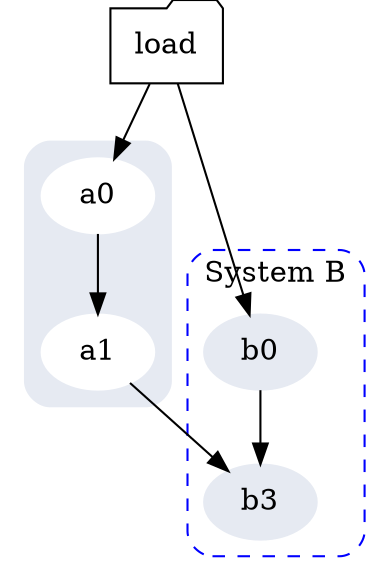

# Using Pandoc And Its GraphViz Filter

To convert Markdown files of a directory, say `$HOME/my_art_work`, into HTML files, while converting the embedded GraphViz figures into SVG images, please run the following command

```bash
docker run -v $HOME/my_art_work:/work cxwangyi/pandoc
```

If in the specified directory there is a CSS file, the above command would use it in all generated HTML files.  If you have more than one CSS files, it uses the first one in alphabetic order.

All renderred GraphViz images are in the directory `$HOME/my_art_work/graphviz_images`.

Click [here](https://htmlpreview.github.io/?https://github.com/wangkuiyi/pandoc-with-graphviz-filter/blob/master/README.html) for the HTML file generated from this README.md file, including the following GraphViz figure.



## References

From [this post](http://nrstickley.com/pandoc/example.html), I learned a command line to call pandoc with the GraphViz filter:

```bash
pandoc README.md -s --smart --mathjax \
         --css nrstyle.css \
         --highlight-style pygments \
         --columns=200 \
         --filter graphviz.py \
         -o README.html
```

where the filter `graphviz.py` comes from [here](https://github.com/jgm/pandocfilters/blob/master/examples/graphviz.py) and the `nrstyle.css` file comes from [here](http://nrstickley.com/pandoc/nrstyle.css). Indeed, you can use whatever CSS file you like or don't use any.

The above command requires pandoc.  The pandoc filter `graphviz.py` requires GraphViz and some Python packages.  `Dockerfile` lists all these dependencies.

## Math

Here attaches a math equation to check if the converter can handle it.

$$\oiint_V f(s,t) \,ds\,dt$$
